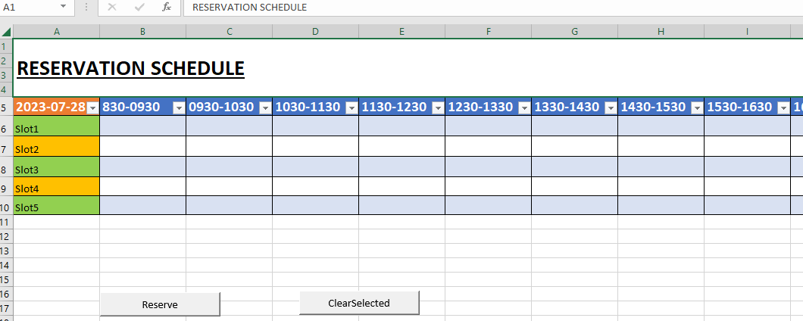
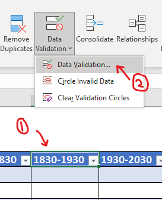
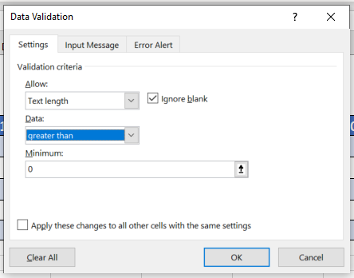

# Reservation Sheet

## Introduction

This project allows users to book/reserve any item of their choice (e.g. Computers, Space and Machines etc). It contains additional features coded in VBA behind the sheet.

## How to use the reservation sheet

1. Clone this project, go to "ReservationProject" and open up the Reservation.xlsm. For the first time, you will be prompted if you want to enable the inbuilt macros, please click YES.  
2. You will see a reservation table like this :
  
In Cell A-5, that is the date of the day, it will be refreshed automatically everyday. You will be able to configure "slots" according to the type of item you want to reserve. You can also change time duration of the table accordingly by using excel Data Validation feature. Refer to the section [Data Validation](#Data-Validation
Add as many rows and columns as you like. If you want, you may lock the cell to prevent unauthorized access. Refer [Data Validation](#Data-Validation)  
3. Use the button "Reserve" and "ClearSelected" to add your name into the selected cells that you are trying to reserve/delete. You may select multiple cells at once.  

## Data Validation

Currently, the cells B5 to O5 are locked with data validation feature. To allow for edit, click on the cells which data you want to change, go to Data > Data Validation . You will see that three fields: Allow, Data, Length, Set Data field to "greater than". Essentially, you are setting text length to be greater than 0, instead of equal to 0.  
    

## Additional Info

- You cannot type manually into the empty cell of the slot you want to reserve
- The booking sheet will take your excel username automatically to reserve the slots
- This excel form can be placed in a common shared drive so that different users can access and reserve their names to it.
